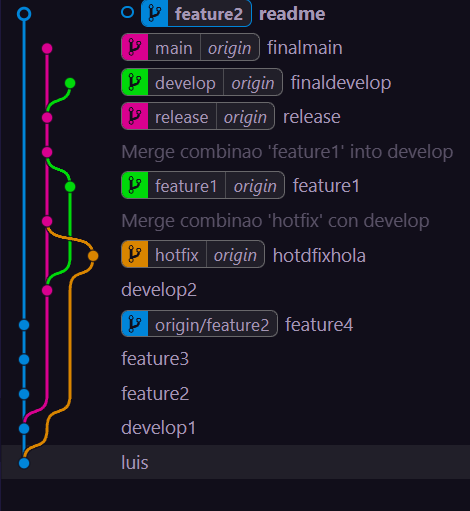

# Estructura Commits
## Para crear la estructura que hay en el gráfico de git tenemos que:
- Crear Ramas:
Nos vamos al apartado de "branches" y le das al "+" y pones el nombre de la rama a crear y le das a "crear branch"
- Realizar Commits:
Tienes que coger los archivos que quieres guardar en un punto y realizar el commit poniendo un mensaje y dandole al botón de confirmar
- Sincronizar Commits:
Tenemos que sincronizar los cambios que has hecho
- Merge:
Para hacer el merge tenemos que entrar en la rama que queremos y darle a los 3 puntos en control de código fuente -> Rama -> Combinar -> y seleccionar la rama que queremos combinar.

